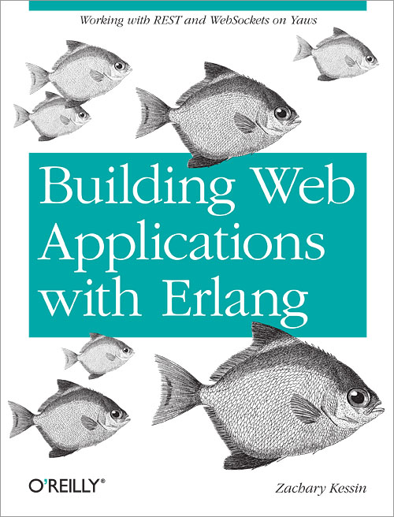
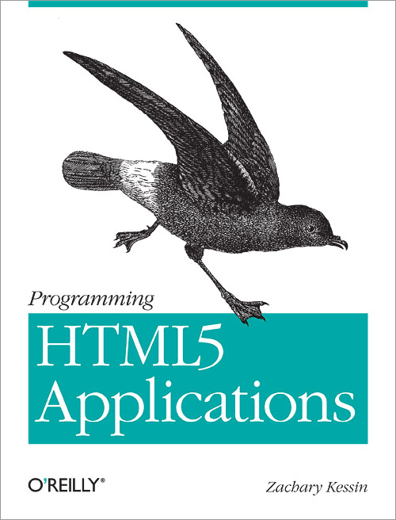

#  Zachary Kessin's Training Classes

Zachary Kessin has been developing applications on the World Wide Web
since around 1993. Over the years he has worked in Perl, PHP, Scheme, 
JavaScript, Erlang, and CoffeeScript. Today Zachary splits his time
between working in CoffeeScript with Backbone in the client as doing
Erlang in the server. 

Zachary Is the author of "Building Web Applications with Erlang"
(2012) and "Programming HTML5 Applications" (2011) Both of which are
published by O'Reilly. Currently he is at work on a new writing
project based around how to build collaborations with git and github.  
 
You can follow Zachary on twitter [@zkessin](http://twitter.com/zkessin)

To book a class please email <zkessin@gmail.com> or call +972 54 234
3956. Classes can be customized and combined as required.

## Availability  
Classes can be taught on demand in person or online. I normally teach
in and around Tel Aviv but can travel as needed. 

### Backbone and Underscore 

When JavaScript was first introduced into the browser with Netscape v
2.0 in 1995 we used it for very simple tasks, such as validating form
input or maybe doing something as complex as computing loan payments. 

Now 17 years later we are building robust complex applications in
JavaScript to run in the browser. Complex applications require a solid
set of libraries and frameworks to build and maintain. 

Backbone.js and Underscore.js were both created as part of the
documentcloud project at the New York Times. Backbone Provides a solid
data handling layer that can be used to handle any application.

Backbone.js provides a number of objects to implement a MVC or MVVM
architecture in the browser, including Models, Collections, Views,
Browser History and more.  

This class will introduce programmers to underscore and backbone as
well as the Marionette package which provides a number of additional
objects for binding Models and Collections to views.  

[Class Syllabus](Backbone/syllabus.html)

### HTML5 For Application Developers (3 Days)

The modern web is dynamic and amazing. As web developers we can build
applications in a browser or on a smartphone that only a few short
years ago would have required a desktop application that was written
in C++ or the like. Now many of those applications can be build (and
have been) in the browser with the tools of the web including
Javascript and CSS. 

We will look at the elements of the modern web including LocalStroage,
Filesystem access, WebSockets, WebWorkers and so on. 

[Class Syllabus](html5_for_application_developers/syllabus.html)

### Functional Programming with CoffeeScript, JQuery and Underscore (2 days)

When Brendan Eich created the language that we now call JavaScript he
based it on two other languages Scheme and Smalltalk. From Scheme
JavaScript inherits first class functions, and it is no surprise that
JavaScript can act a very nice functional language.

When you add CoffeeScript, jQuery and underscore.js to the mix it
becomes even more powerful to use functional abstractions to build
programs in the browser environments. 

By chaining a number of small simple operations it is possible to
build up an algebra of functions and operators which enable the
developer to build a lot of power very quickly.
 

NOTE: Class assumes some familiarity with JavaScript and web
development. Prior experience with functional programming is useful
but not necessary.
  

[Class Syllabus](functional_programming_with_coffeescript/syllabus.html)

### Building Collaborations with Git and Github 

Software like so many other things is about collaboration, and good
collaboration needs good tools. In fact Joel Spolsky in his famous
"Joel Test" puts +Do you have source control+ as the first item. 

The current best of type source code control system is git, which was
created by Linus Torvolds to manage the linux kernel project. Git has
a reputation for being complex but the truth is that the parts of git
that are actually required for managing a project are pretty simple. 

We will show how to use git from the Bash command line, Emacs,
Eclipse, and the Mac and Windows. 

In addition we will focus on github as a tool for collaborations. The
class will show the various major features of github as they relate to
how people can collaborate on different projects. 
 

[Class Syllabus](collaborating_with_git/syllabus.html)

